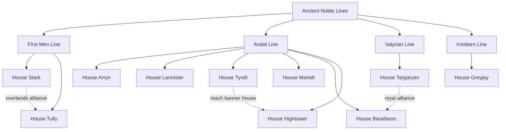

# Westeros Raven Service

A tiny, dependency-free JavaScript service for routing fictional ravens between the great houses of Westeros.

> This is a fan-made demo project. It is not affiliated with HBO, Warner Bros., or George R. R. Martin.

## Quick start

```bash
npm test
npm start
node src/index.js --origin Sunspear --destination Winterfell --show-standings --house-limit 3
```

The service prints a sample route from Winterfell to King's Landing. All names and descriptions are short, original demo data rather than copied story text.

## Project map

- `src/houses.js` — house and seat data
- `src/routes.js` — shortest-route calculation
- `src/index.js` — small command-line demo
- `src/standings.js` — house operations board data
- `test/index.test.js` — CLI and standings tests
- `test/routes.test.js` — route tests

## Illustrative House Lineage

This diagram is intentionally lightweight and demo-friendly rather than a full canon family tree.



## Roadmap

- Raven priority classes
- Winter weather alerts
- Maester operations guide

