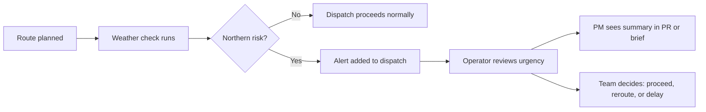

# Small Council Brief: Winter Watch Alerts

This page shows the kind of GitHub-friendly synthesis artifact that helps PMs, operators, and other non-technical readers understand a technical change without reading the implementation first.

## Executive summary

We are adding winter-watch alerts to the raven network so operators can spot northern delivery risk earlier and reroute time-sensitive messages before delays stack up.

## Why this matters

- Northern routes are the most weather-sensitive part of the network.
- Delayed alerts create confusion for court operators and leadership.
- A simple early-warning layer is easier to explain than low-level routing changes.

## What a PM should know

- This is an internal operations improvement, not a customer-facing feature.
- The change should reduce surprise delays for messages touching `Castle Black`, `Winterfell`, and nearby relays.
- If it works, the next likely step is auto-suggested rerouting for urgent dispatches.

## Rollout snapshot

- Stage: Ready for review
- Owner: Maester of Messages
- Audience: Operations, PM, and leadership
- Success signal: fewer urgent deliveries stuck in northern weather queues

## Risks

| Risk | Why it matters | Mitigation |
| --- | --- | --- |
| Too many alerts | Operators may ignore noisy warnings | Start with severe weather only |
| Alerts without clear next steps | PMs may understand the problem but not the action | Include recommended reroute guidance in follow-up work |
| Misread urgency | Teams may assume all weather alerts are launch blockers | Label alerts as advisory vs critical |

## Suggested PR summary

Use this as the opening section of a pull request:

> This change adds winter-watch alerts for raven routes that pass through the North. The goal is to help operators and PMs see delivery risk earlier, especially for urgent messages that would otherwise be delayed by weather near Castle Black and Winterfell.

## Rollout diagram

## Why this works well on GitHub

- The PR template makes the most important information appear above the code diff.
- The brief can live in the repo and evolve with the feature.
- Mermaid renders directly in GitHub, which makes the workflow easy to demo live.
